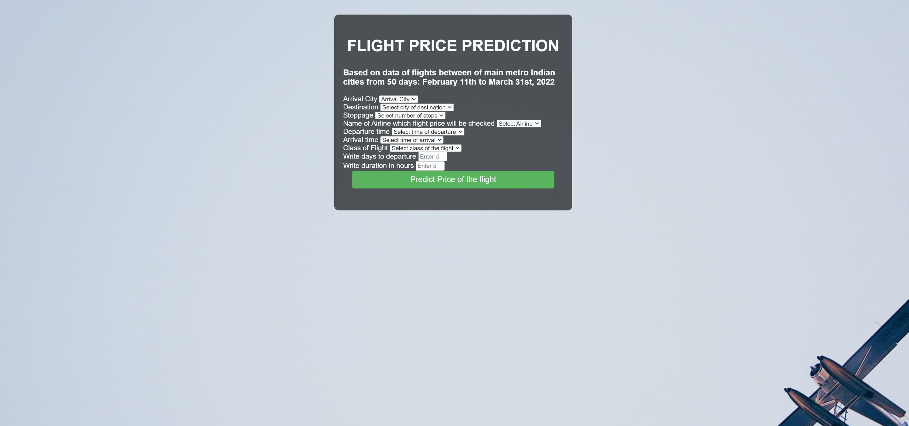

## MLOPS Flight Price Prediction - Full Process

## Description and shortened context of the training data

The project involves taking data, analyzing it, processing it to ultimately apply the chosen machine learning model to indicate price of flight based on given factors and then deploying the model on ECS native orchestraton in the form of a web application.

## Main Technologies used:

### Data Collection

- Source of data: hhttps://www.kaggle.com/datasets/shubhambathwal/flight-price-prediction?select=Clean_Dataset.csv

Dataset contains information about flight booking options from the website Easemytrip for flight travel between India's top 6 metro cities. There are 300261 datapoints and 11 features in the cleaned dataset.

## Stages to reproduce the project

1. Planning desired outcome.
2. Configuration of environment setup.
3. Preparation of notebooks to EDA and experimenting with initial training approach.
4. Development of a modular files dealing with:
    - data ingestion,
    - data transformation,
5. Model evaluation with hyperparameter tunning
6. Local deployment of prediction model
7. Model compression in local environment
8. Setting Dockerfile locally for Run it on Virtual Machine EC2 with ECR after setting IAM
9. Creating task definition within ECS with required memory and cpu to perform task in the next step
10. Creating ECS cluster to run a service which use task definition to create task
11. Creating of an application load balancer to distribute prediction requests from users 
12. Final setting inbound rules and security groups
13. The prediction is available on DNS adress of created load balancer

